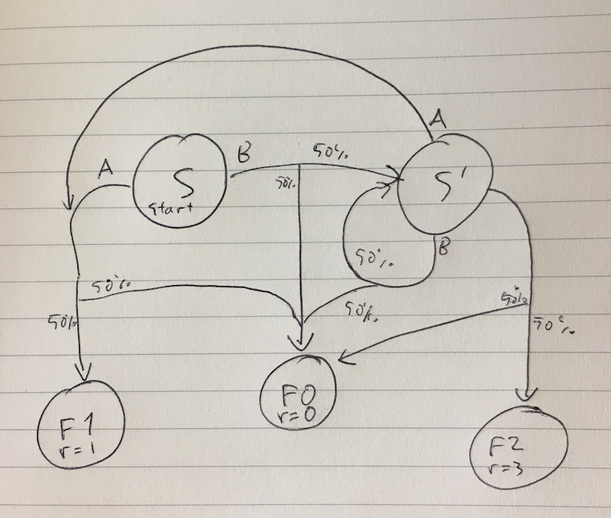

# Findings

Assumptions, observations and other findings from modelling Dominion and developing control methods for it.

## Assumption, 26/7/2018

MC policy evaluation should produce results with simplified Dominion even if
state is not modelled, and Q(S, A) is treated as just a function of actions A.

This thought is based on how it would be possible (based on human knowledge of the game)
to rank actions into a static priority list that results in reasonably good play in the trivial
"treasures & victory cards only" board. This priority list could be e.g. Play Gold =
Play Silver = Play Copper = Buy Province > Buy Gold > Buy Silver > Buy Duchy > End Turn >
any other actions.

## Observation, 27/7/2018

With MC policy evaluation & control, Q purely as a function of A, initially playing against a completely
random opponent, and updating the epsilon greedy policy after every episode,
the system very quickly learns a policy that buys cards up to duchies (and occasionally better)
and manages to finish the game with a high score (e.g. 25-40 points) around 80 turns. For comparison the
completely random opponent playing against itself needs 200 to 280 turns to finish
a game and finishes at a low score (e.g. 12 points). On the other hand
a good human player can finish the game in approximately 25 turns with a score
of ~50 if the other player doesn't contribute to game end conditions.

## Observations, 28/7/2018

Playing against a random opponent leads to stagnation after fewer than 100 games,
because an MC control based agent quickly reaches 100% win rate at which point
the undiscounted return does not provide a learning signal anymore.

Note: try discounting the rewards in the return in case that helps

Self play is not trivial to get working. Switching opponents invalidates Q values,
and if one were to continue with old Q values, the result would be that the most
often taken actions would be deemed worse than before, because a stronger opponent
wins more games leading to lower returns overall.

It seems difficult for the Q = f(A) approach to learn that playing coppers is
a good idea. They usually end up with a lower Q value than e.g. buying an estate,
which leads to suboptimal behaviour. The reason must be that on average, playing
a lot of coppers is indeed correlated with poor performance, despite the fact
that playing coppers instead of purchasing a card before playing coppers
is (in this simple variant of the game) always optimal. Whether allowing the
algorighm to start looking into (an incomplete view of) state will help is
one of the things I'd like to investigate next, but for that, it seems like
I also need better ways to keep track of how well the training is performing.

## Analysis, 5/8/2018

Turns out that tracking the state accurately is critical for MC policy evaluation to work.
If samples from different states are confounded, the algorithm won't produce
correct results. This must be behind the poor results.

As an example for a simple MDP where this problem is evident, consider Figure 1. below. Assume S is the starting state and F0, F1, F2 are the terminal states. F0 is a bad state, F1 is a good state, and F2 is the better state. Action A aims to reach the good state, action B aims to reach an intermediate state S', and action C aims to reach the better state. Action C is only available in state S'. All actions have a 50% chance of ending up in the bad state instead of the destination mentioned above.

*Figure 1. A simple case where the MC evaluation problem comes up*

When we solve for undiscounted Q values manually, we find out that Q(S, B) = 0.75 is the highest Q value of any action in state S, and Q(S', C) = 1.5 is the highest Q value in state S', meaning that B and C are the optimal actions in these states respectively. However, if we try to evaluate a uniformly random policy with MC policy evaluation, but implement it in such a way that the algorighm cannot keep track of which actions happen in S vs in S', we get an incorrect result where the quality of action B is underestimated, and action A ends up being ranked higher than it (I get Q(state in {S, S'}, B) ~= 0.4, whereas Q(S, A) = 0.5).

I suspect something like this is happening re: playing treasures and buying better treasures vs buying coppers and estates.
